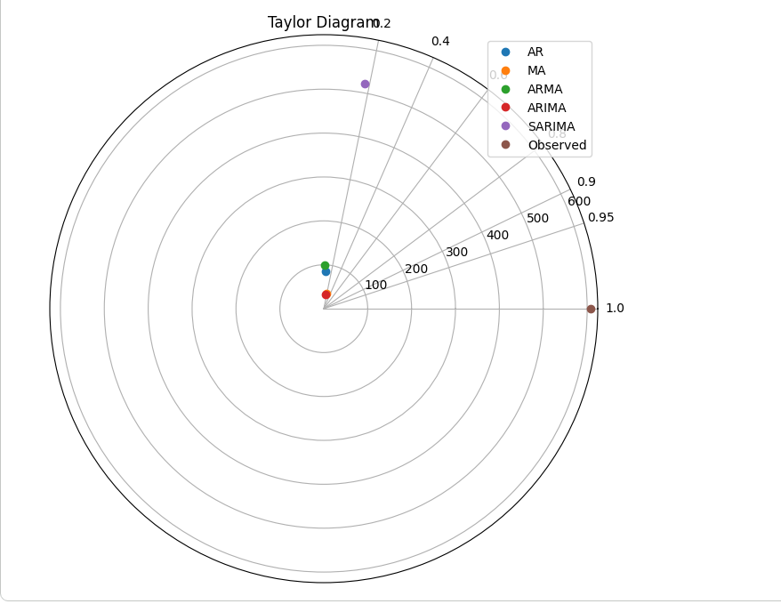
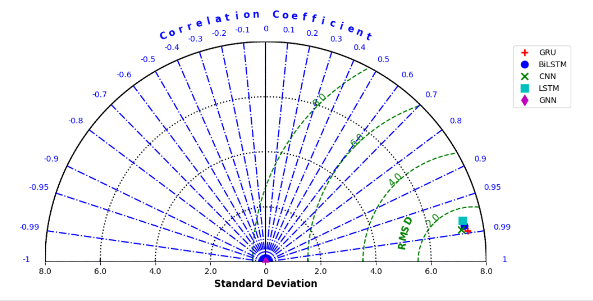

# Time Series Forecasting: Traditional vs Deep Learning Models

##  Overview

This repository presents a comparative study of time series forecasting using:

* **Traditional Statistical Models** (Sales Data)
* **Deep Learning Models** (Temperature Data)

The project demonstrates a complete pipeline including **data preprocessing, decomposition, exploratory analysis, modeling, and evaluation**.

---

## 📊 Project Structure

```
time-series-forecasting/
│
├── sales_forecasting/
│   ├── sales_traditional_models.ipynb
│   └── data
│
├── temperature_forecasting/
│   ├── temperature_deep_learning.ipynb
│   └── data
│
├── assets/
│   └── images
│
└── README.md
```

---

## 📈 Sales Forecasting (Traditional Models)

### ✔ Workflow

* Time series decomposition (Trend, Seasonality, Residuals)
* Stationarity analysis
* Graphical analysis (ACF, PACF)
* Model building and forecasting

### ✔ Models Used

* AR (Auto Regression)
* MA (Moving Average)
* ARMA
* ARIMA
* SARIMA

### 📊 Performance Visualization



---

## 🌡️ Temperature Forecasting (Deep Learning Models)

### ✔ Workflow

* Data preprocessing and normalization
* Sequence generation for time series
* Model training and evaluation

### ✔ Models Used

* LSTM
* BiLSTM
* GRU
* CNN
* GNN

### ✔ Evaluation Metrics

* RMSE (Root Mean Square Error)
* Standard Deviation
* Correlation Coefficient

### 📊 Performance Visualization



---

## ⚙️ Tech Stack

* Python
* NumPy, Pandas
* Matplotlib, Seaborn
* Statsmodels
* Scikit-learn
* TensorFlow / Keras

---

## 📌 Key Highlights

* Comparative analysis between statistical and deep learning approaches
* Use of **Taylor Diagrams** for model performance evaluation
* End-to-end pipeline from preprocessing to forecasting
* Application on two different real-world datasets

---

## 🚀 How to Run

1. Clone the repository:

```bash
git clone https://github.com/YOUR_USERNAME/time-series-forecasting.git
```

2. Install dependencies:

```bash
pip install -r requirements.txt
```

3. Open notebooks:

```bash
jupyter notebook
```

---

## 📎 Future Improvements

* Hyperparameter tuning for deep learning models
* Cross-dataset generalization
* Deployment as a web-based forecasting tool

---

##  Author

Nikita Mittal
B.Tech CSE | Time Series & Machine Learning Enthusiast
